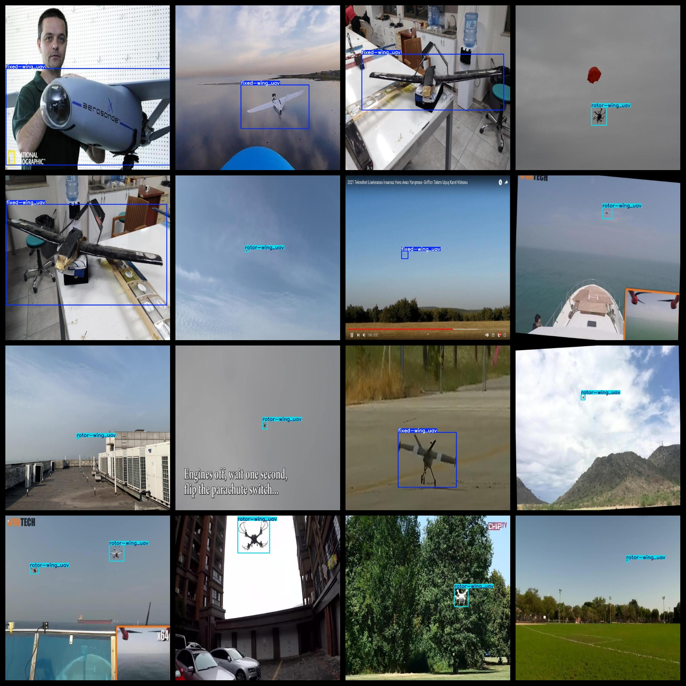
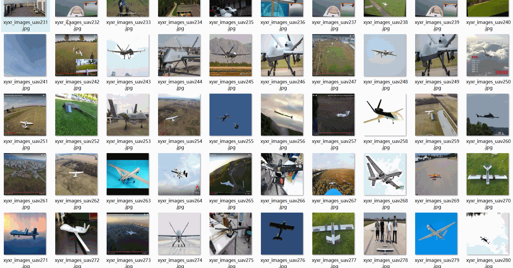

# Fixed Wing UAV Swirl Wing UAV Dataset 3847 imagesVOC+YOLO format

Fixed Wing UAV Rotary Wing UAV Dataset 3847 VOC + YOLO Format

Dataset format: Pascal VOC format + YOLO format (the txt file does not contain the split path, it only contains jpg images and corresponding VOC format xml files and yolo format txt files)

Number of images (number of jpg files): 3847

Number of xml files: 3847

Number of txt files: 3847

Label count: 2

The Github repository is: datasets_sl

["rotor-wing_uav", "fixed-wing_uav"]

Number of boxes labeled in each category:

fixed-wing_uav frame count = 1428 (fixed-wing UAV)

Rotor-wing UAV frame count = 2894 (rotor-wing unmanned aerial vehicle)

Total frame count: 4322

Number of images per category:

Fixed-wing UAV has 1350 pictures.

The number of images in rotor-wing UAV = 2497

Image resolution: 1024x1024

Use the labeling tool: labelImg

Dataset Augmentation: Yes

Rules for annotation: Draw a rectangle around the category.

Important note: The dataset does not have been divided into training, validation, and testing sets.

Special Disclaimer: This dataset does not guarantee the accuracy of the trained models or weight files.

Annotation and image details are as follows:

## Images

---

Here is a pay link on Stripe (https://buy.stripe.com/3cs8yP7sY87d0vu9AB). Please contact me lonlonago@foxmail.com after funding $89, and I will send you a complete data files, thank you!

